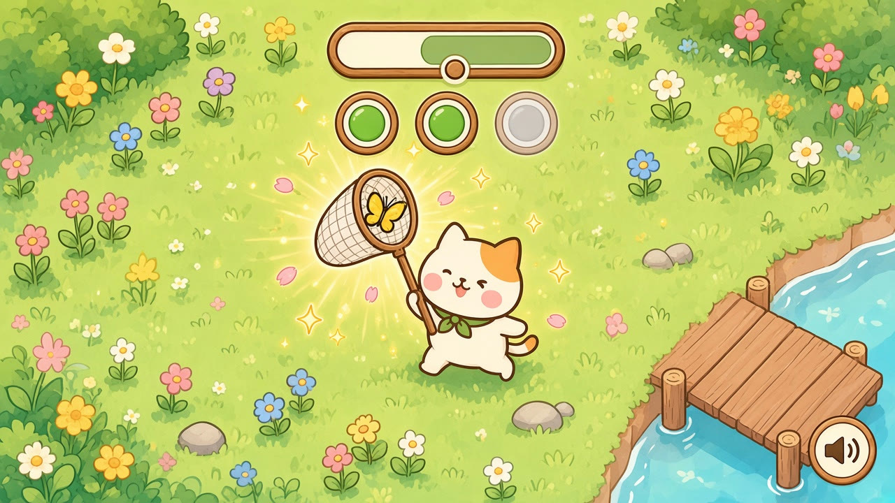
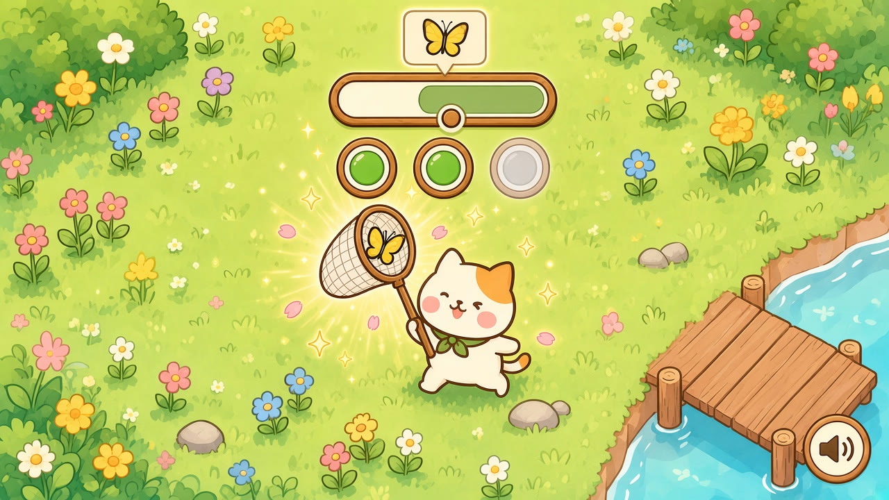
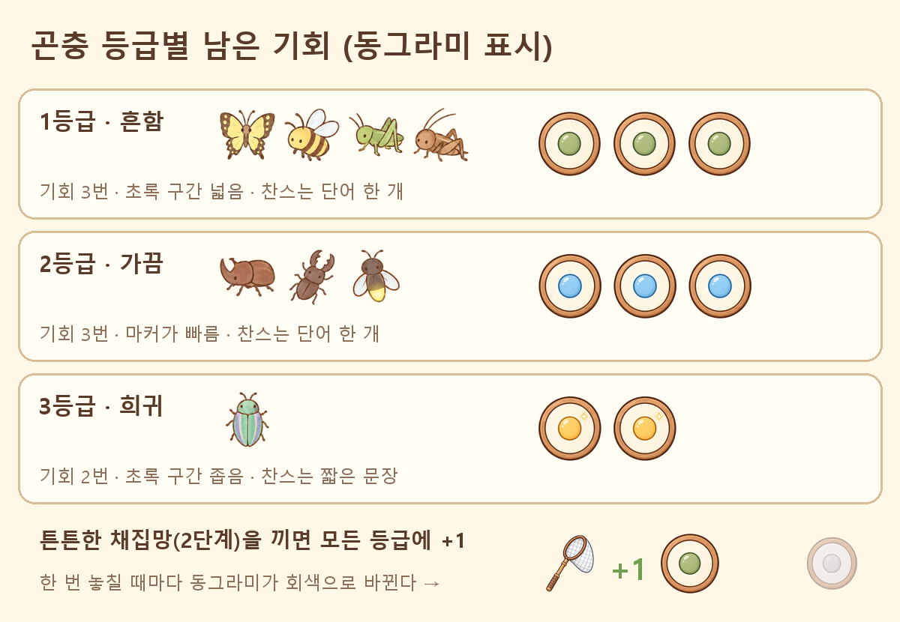
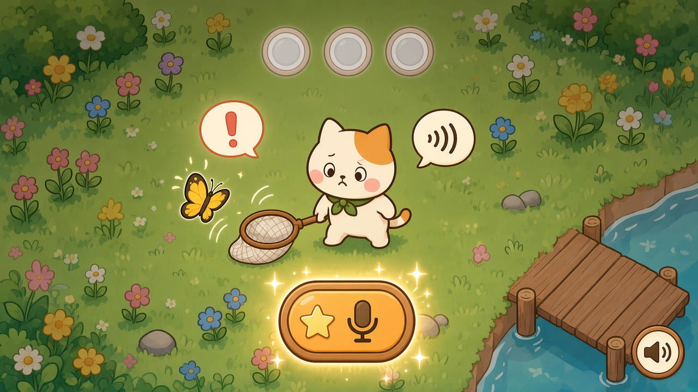
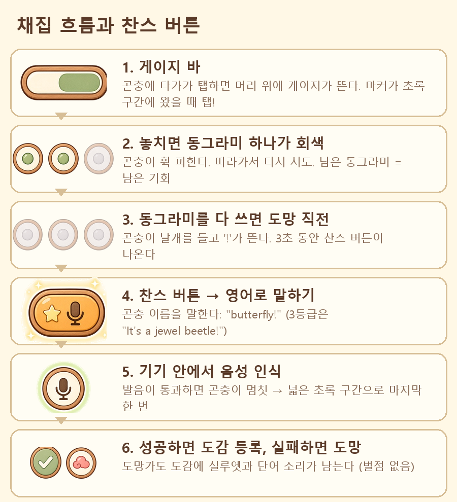
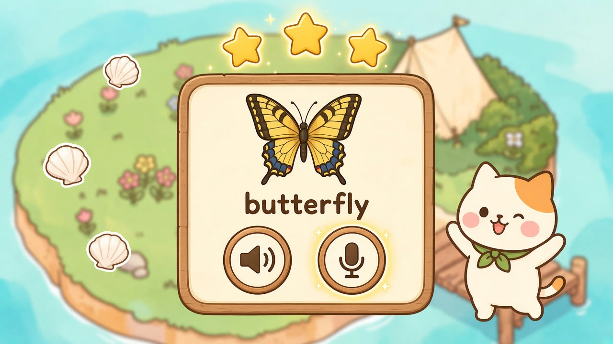

# Island — 채집 판정·찬스 버튼·말하기 보상 기획

> 작성일: 2026-10-02 · 상태: 초안 v0.1 (수치는 플레이테스트로 조정)
> 관련: `REWARD_SYSTEM.md`(장비·조개), `WEATHER_AND_SPAWN.md`(날씨 보정), `DESIGN_AND_TECH_PLAN.md` §4.4(영어 학습), UI 에셋 `assets/ui/catch/`

---

## 1. 한 줄 요약

**잡는 건 손으로(게이지), 보상은 입으로(영어).** 게이지 바로 곤충을 잡으면 도감에 오른다. 조개 같은 보상은 단어 카드에서 영어로 바르게 말해야 받는다. 기회를 다 써서 곤충이 도망가기 직전에는 **찬스 버튼**이 떠서, 곤충 이름을 영어로 말하면 마지막 한 번을 더 얻는다.

원칙:

1. 말하기는 **보상을 키우는 길**이지 진행을 막는 벽이 아니다. 발음이 안 돼도 도감 등록은 된다.
2. 판정은 **너그럽게**. 아이 목소리는 인식률이 낮아서 기준을 낮게 잡고, 점수는 숫자 대신 별(1~3개)로 보여 준다.
3. 틀려도 빨간 X는 없다. "oops" 구름과 다시 하기 버튼, 그리고 들려주기가 나온다.
4. 음성은 **기기 안에서만** 인식하고 저장하거나 서버로 보내지 않는다(설계서 원칙).

---

## 2. 채집 화면



| 요소 | 에셋 | 설명 |
|---|---|---|
| 게이지 바 | `gauge_track.png`, `gauge_marker.png` | 고양이 머리 위. 마커가 좌우로 왕복하고 초록 구간에서 탭하면 성공 |
| 남은 기회 동그라미 | `pip_green/blue/gold.png`, `pip_empty.png` | 게이지 바 바로 아래. 놓칠 때마다 오른쪽부터 하나씩 회색이 된다. 색은 곤충 등급 |
| 스피커 버튼 | `speaker.png` | 화면 구석. 누르면 지금 곤충의 영어 이름을 들려준다(잡기 전에 미리 듣기) |

성공하는 순간: 마커가 초록 구간에서 멈추면 구간이 금빛으로 번쩍이고, 포충망 스윙과 반짝이·별·꽃잎이 터진다. 그 위로 단어 카드가 튀어나온다. 동그라미는 남은 만큼 그대로 보인다(아래 그림은 두 번째 시도에서 잡은 경우).



---

## 3. 곤충 등급별 남은 기회



| 등급 (`species.json` `rarity`) | 동그라미 | 초록 구간(1번째) | 마커 왕복 | 찬스 때 말할 것 |
|---|---|---|---|---|
| 1 · 흔함 (나비·꿀벌·메뚜기·귀뚜라미·나방·지렁이·달팽이…) | 초록 3개 | 34% | 1.0초 | 단어: `butterfly` |
| 2 · 가끔 (장수풍뎅이·사슴벌레·반딧불이·물방개…) | 파랑 3개 | 26% | 0.85초 | 단어: `beetle`, `firefly` |
| 3 · 희귀 (비단벌레) | 금색 2개 | 20% | 0.7초 | 짧은 문장: `It's a jewel beetle!` |

- 놓칠 때마다 초록 구간은 좁아지고 마커는 빨라진다(`REWARD_SYSTEM.md` §2 수치).
- **튼튼한 채집망(2단계)**을 끼면 모든 등급에 동그라미 +1.
- 날씨 보정(비·바람)은 `WEATHER_AND_SPAWN.md` §4를 더한다. 비 생물(지렁이·달팽이)은 원래 쉽다.
- 이전 기획의 "4번째 게이지가 뜨면 도망"은 이 규칙으로 바뀐다. 1등급 동그라미 3개를 다 쓰면 4번째 게이지 대신 찬스가 뜬다.

---

## 4. 찬스 버튼 (도망 직전)





1. 동그라미를 모두 쓰면 곤충이 날개를 들고 "!"를 띄운다. **5초** 동안 찬스 버튼(`chance_button.png`)이 화면 아래 가운데에 반짝인다. 버튼 둘레의 링이 줄어들며 남은 시간을 보여 준다.
2. 찬스 버튼을 누르면 마이크가 켜진다(`mic_listening.png`). 곤충 이름을 말한다. 3등급은 짧은 문장을 말한다.
3. **통과**하면 곤충이 놀라서 잠깐 멈춘다. 초록 구간 +15%p(3등급은 +20%p), 마커 느리게로 마지막 게이지 한 번을 준다.
4. **실패**하거나 5초 안에 누르지 않으면 곤충이 도망간다. 도감에는 실루엣과 단어 소리가 남는다.

- 찬스는 곤충 한 마리에 **한 번만** 쓸 수 있고, 하루 사용 횟수 제한은 없다.
- 그 단어를 아직 배우지 않았으면 먼저 단어를 들려주고(스피커가 자동으로 재생됨) 마이크를 켠다. 듣고 따라 말하기다.
- 5초 제한은 말하는 시간이 아니라 **버튼을 누를 때까지**다. 말하기는 5초를 따로 기다린다.
- 3등급이 도망가면 같은 섬 하루(섬 시계 20분) 안에 **한 번 더** 나타난다. 동그라미가 2개뿐인 희귀 곤충을 한 번 놓쳤다고 그날을 통째로 잃지 않게 하기 위해서다.

---

## 5. 단어 카드와 말하기 보상



잡으면 단어 카드가 뜬다. 카드 구성은 다음과 같다:

- 그림(`assets/words/`)과 단어
- 스피커(`speaker.png`): 원어민 발음 듣기
- 거북이(`slow.png`): 천천히 듣기
- 마이크(`mic.png`): 말하기

| 결과 | 표시 | 조개 (처음 잡은 종) | 조개 (다시 잡은 종) |
|---|---|---|---|
| 별 3개 (또렷하게 맞음) | `check.png` + 별 3 | 5 + 첫 포획 보너스 5 | 희귀도 × 1 |
| 별 2개 (거의 맞음) | 별 2 | 3 + 5 | 희귀도 × 1 |
| 별 1개 (비슷함, 또는 3번 실패 후 "듣고 따라 하기"까지 함) | 별 1 | 1 + 5 | 1 |
| 말하기 건너뜀 | — | 첫 포획 보너스 5만 | 0 |

- 3번까지 다시 말할 수 있다(`retry.png`). 3번 다 안 되면 "같이 말해 보자" 모드가 된다. 단어를 한 번 더 들려주고 따라 말하면 별 1개를 준다. **노력하면 반드시 별을 받는다.**
- **다시 잡은 종**: 그 단어를 아직 "익힘"(복습 상자 2칸 이상)이 아니면 말해야 조개를 받는다. 익힌 단어는 말하지 않아도 조개 희귀도 × 1을 바로 준다. 반복은 배울 때까지만 하고, 다 배운 뒤에는 귀찮은 일이 되지 않게 한다.
- 별 3개를 받은 단어는 복습 상자(Leitner)에서 한 칸 올라간다. "익힘" 판정에 쓰여 장비 강화 조건(`REWARD_SYSTEM.md` §3.1)과 이어진다.

---

## 6. 발음 판정 방식

- **기기 내장 음성 인식**(iOS 온디바이스 Speech, Android 오프라인 인식)으로 들은 문장 후보(보통 상위 3~5개)를 받는다.
- 목표 단어와 비교한다:
  - 후보에 정확히 있음 → 별 3
  - 철자 거리가 가까움(예: `butterfy`) → 별 2
  - 첫 소리와 길이가 비슷함 → 별 1
  - 아무 소리도 없음 → 실패가 아니라 "조금 더 크게 말해 볼까?"
- 문장(3등급 찬스)은 핵심 단어(`jewel beetle`)가 들리면 통과로 본다. 앞뒤(`It's a`)는 별 개수에만 반영한다.
- 보호자 설정에서 판정 기준을 "너그럽게 / 보통" 중에서 고를 수 있다.
- 녹음 파일은 만들지 않는다. 인식 결과 글자도 별 계산이 끝나면 버린다.

---

## 7. 마이크를 쓸 수 없을 때 (대체 모드)

마이크 권한이 없거나, 조용히 해야 하는 곳이거나, 말하기가 어려운 아이를 위한 모드다.

- **그림 고르기 모드**: 단어를 듣고 맞는 그림을 2~3개 중에서 고른다. 정답이면 **별 2개와 같은 보상**(조개 3)을 준다. 말하기가 어려운 아이가 계속 손해를 보지 않게 하기 위해서다. 틀리면 정답 그림을 보여 주고 다시 고르게 한다.
- 찬스 버튼도 "듣고 맞는 그림 고르기"로 바뀐다.
- 화면 구석의 마이크 아이콘으로 언제든 켜고 끌 수 있다.

---

## 8. UI 에셋 목록 (`assets/ui/catch/`, Grok)

| 파일 | 쓰임 |
|---|---|
| `speaker.png` / `speaker_playing.png` | 듣기 버튼 / 재생 중 |
| `mic.png` / `mic_listening.png` | 말하기 버튼 / 듣는 중(초록 빛) |
| `chance_button.png` | 도망 직전 찬스 |
| `pip_green.png` · `pip_blue.png` · `pip_gold.png` · `pip_empty.png` | 등급별 남은 기회, 다 쓴 기회 |
| `gauge_track.png` · `gauge_marker.png` | 게이지 바 |
| `check.png` · `oops.png` · `retry.png` | 맞음 · 아쉬움 · 다시 |
| `speech_wave.png` | "말해 보세요" 말풍선 |
| `slow.png` | 천천히 듣기 |

단어 그림은 새 생물 4종을 추가했다(`assets/words/worm.png`, `snail.png`, `water_beetle.png`, `water_strider.png`).

---

## 9. 데이터 (구현 시)

```jsonc
// data/catch.json
{ "rarity": {
    "1": { "pips": 3, "pip": "green", "zone_pct": 34, "period_s": 1.0, "chance": "word" },
    "2": { "pips": 3, "pip": "blue",  "zone_pct": 26, "period_s": 0.85, "chance": "word" },
    "3": { "pips": 2, "pip": "gold",  "zone_pct": 20, "period_s": 0.7, "chance": "sentence" } },
  "chance": { "window_s": 5, "speak_timeout_s": 5, "bonus_zone_pct": 15, "bonus_zone_pct_rare": 20, "marker_slow": 0.6, "rare_reappear": 1 },
  "speaking": { "retries": 3, "stars_coins": [1, 3, 5], "first_catch_bonus": 5 } }
// species.json에 찬스 문장 추가: { "id": "jewelbeetle", "chance_line": "It's a jewel beetle!" }
```

---

## 10. 정한 것 (2026-10-02)

1. **3등급 동그라미는 2개로 둔다.** 등급마다 기회가 달라야 희귀 곤충이 특별하게 느껴진다. 대신 3등급의 찬스는 초록 구간을 +20%p로 넓게 주고, 도망가도 같은 섬 하루 안에 한 번 더 나타난다.
2. **찬스 대기 시간은 5초.** 초등 저학년이 화면을 읽고 버튼을 누르기에 3초는 짧다. 줄어드는 링으로 남은 시간을 보여 준다.
3. **다시 잡은 종은 단어를 익힐 때까지만 말하기를 요구한다.** 익힌 뒤에는 말하지 않아도 조개를 준다.
4. **그림 고르기 모드의 정답은 별 2개와 같은 보상.** 말하기 대신 이 모드를 쓰는 아이가 계속 손해 보지 않게 한다.
