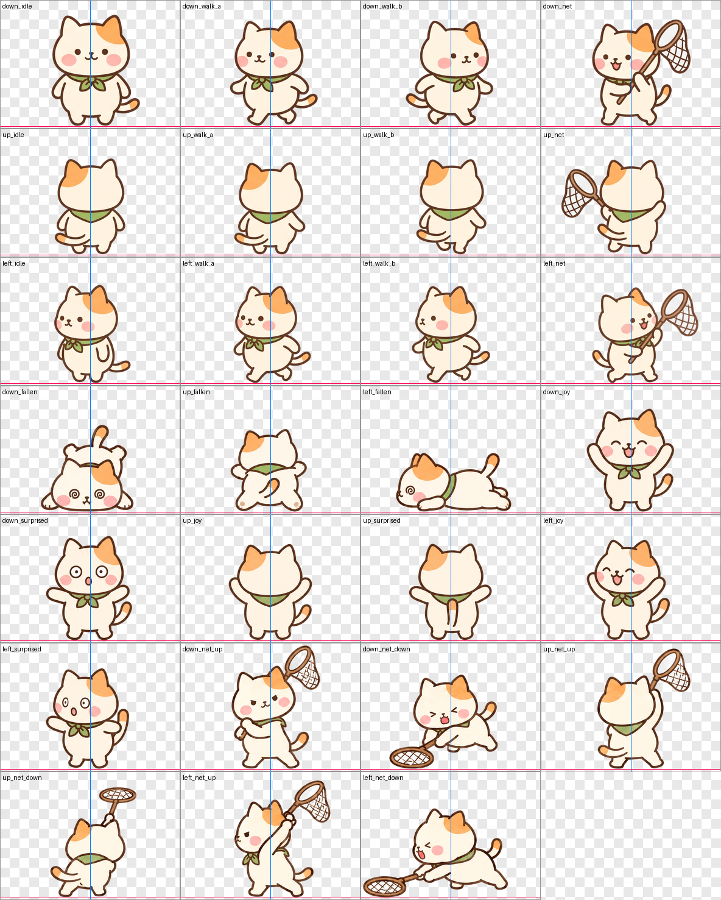
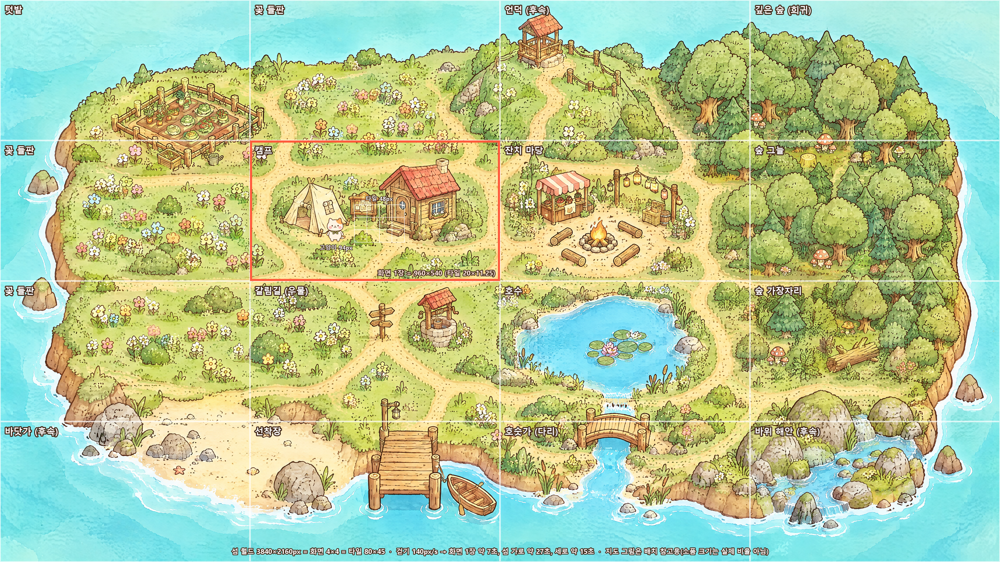
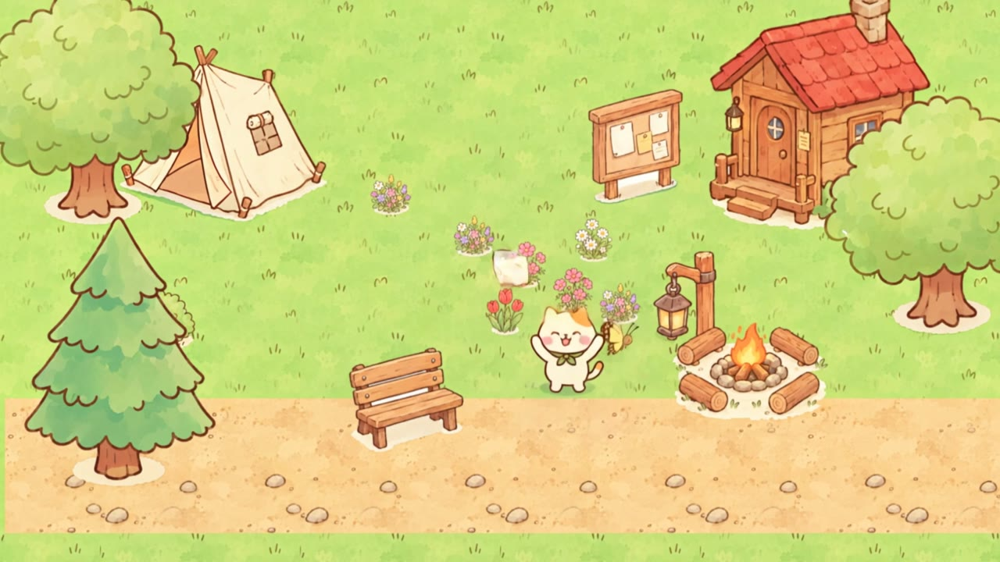
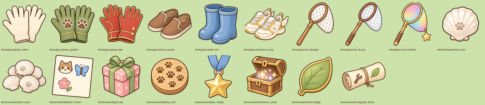
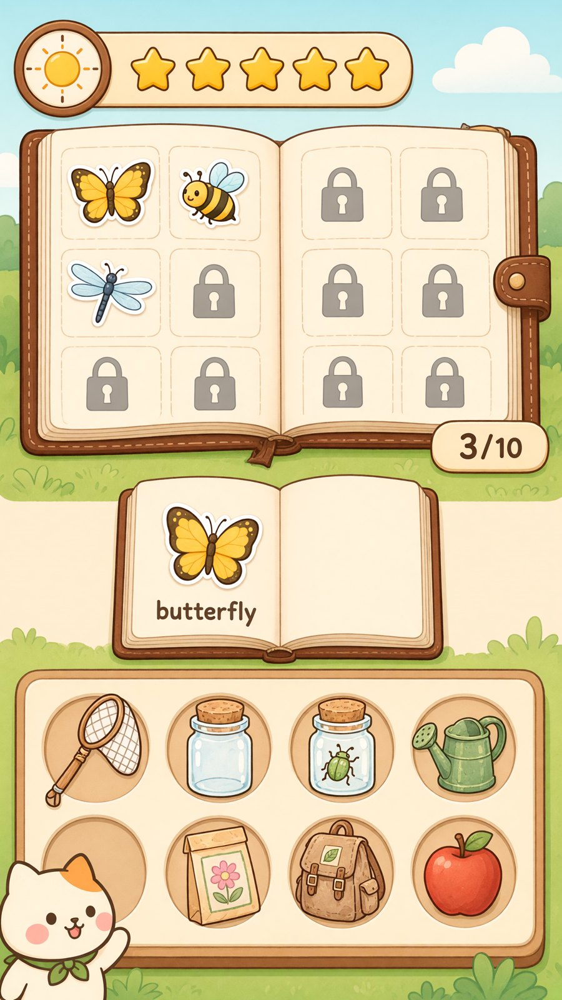
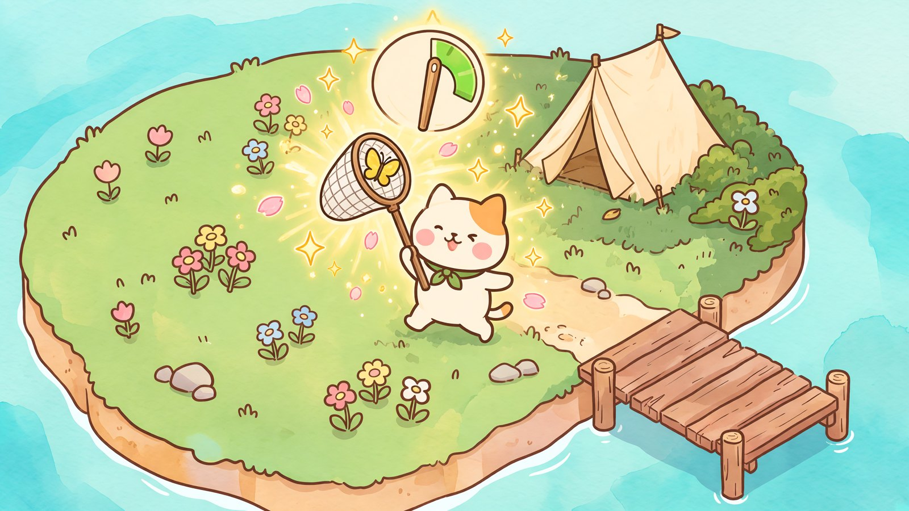

# 개발 일지

Island를 만드는 과정을 **주 단위**로 정리한다. 주제마다 **이전 기획**과 **확정 기획** 두 시점만 남기고, 중간 시안은 지운다. 오류, 문제 해결, 개선안은 다음에 같은 실수를 하지 않도록 남긴다.

---

## 2026년 40주차 · 9월 28일 – 10월 4일

이번 주 요약: 캐릭터·곤충·환경·UI 에셋 약 320개, 4×4 섬 설계, 소개 사이트, 채집 판정(게이지 바), 장비·보상 기획.

### 캐릭터 시트와 도구

| 이전 기획 | 확정 기획 |
|---|---|
| AI가 그린 캐릭터 시트(삼색·샴)를 프레임마다 새로 그려서 쓴다 | **도구로 정렬·재사용**한다: `sprite_slicer.py`(시트 → 아틀라스), 7인 팔레트 스왑, 액션은 `data/actions/*.json` 파라미터로 만든다 |

### 곤충 (16종 → 10종)

> "채집할 곤충에 대한 에셋도 16종 1 시트에 만들어 봐 어떤 곤충을 하지 선택할게 번호도 붙혀"

| 이전 기획 | 확정 기획 |
|---|---|
| 16종 한 시트, 고양이 캐릭터 그림체를 그대로 따른다 | 콘셉트 이미지의 나비처럼 **단순하고 귀여운** 10종: 호랑나비·꿀벌·잠자리·메뚜기·장수풍뎅이·사슴벌레·반딧불이·귀뚜라미·나방·비단벌레. 고양이와 같은 3×4 동작 시트(앞·뒤·옆 / 대기·이동·이동·도망) |

**문제·해결**

- 곤충이 고양이 얼굴(큰 눈·볼터치)을 따라 해서 캐릭터처럼 보였다 → 참고 이미지를 넣을 때 **"무엇을 따라 하지 말 것"**까지 적는다.
- 고치고 나니 도감처럼 너무 사실적이었다 → 콘셉트 이미지의 링 안 나비를 기준으로 삼았다.
- 장수풍뎅이 뿔이 사슴벌레처럼 두 갈래로 나왔다 → 외뿔로 다시 그렸다.

### 섬 크기와 환경 에셋

> "섬을 사이즈를 캐릭터에 얼마나 차지 하는지 전체 구상도도 생성해" → "4×4로 해줘"

| 이전 기획 | 확정 기획 |
|---|---|
| 3×3 구역 | **4×4 구역 = 3840×2160px**. 타일 48px, 고양이 약 92px, 구역 1개 = 화면 960×540. 걸어서 가로지르는 데 약 27초 |
| 환경은 섬 배경 그림 한 장 | 나무·풀·꽃·건물·소품·물가 **54개** + 반복 바닥 9종 + 경계 타일(잔디↔바다, 흙길↔잔디, 모래↔바다). `env_slicer.py`로 잘라 월드 크기를 맞춘다 |

섬 넓이는 에셋과 상관없다. 구역 수를 바꿀 때는 맵 크기와 `data/world/zones.json`만 고치면 된다.

### 빠진 에셋 보충

| 이전 기획 | 확정 기획 |
|---|---|
| 캐릭터·곤충·환경만 있음 | 2D 모바일 게임의 일반적인 에셋 분류와 비교해 `ASSET_CHECKLIST.md`로 관리한다. UI, NPC 3명(아틀라스·초상화), 작물 4색×5단계, 단어 그림 12, 아이템, 물고기 9, 효과·날씨, 앱 아이콘을 보충했다 |

**문제·해결**

- 박사님이 말하는 동작이 손가락 하나를 세운 모양으로 나왔다 → 손바닥을 펴고 흔드는 동작으로 다시 그렸다.
- 남은 것: 오디오(TTS·효과음·배경음). 이미지 생성 도구로는 만들 수 없어서 TTS 업체부터 정해야 한다.

### 채집 판정과 시연 영상

> "영상을 보니까 한방에 잡던데 나비가 불규칙적으로 가고 잡는 판정을 게이지 바로 통해 시도를 해서 4번 게이지바가 뜨면 빠르게 곤충이 도망가는 영상으로 바꾸어"

| 이전 기획 | 확정 기획 |
|---|---|
| **타이밍 링**. 나비가 일정하게 날고, 한 번에 잡으면 단어 카드가 뜬다 | **가로 게이지 바**. 나비가 불규칙하게 날고, 시도할수록 초록 구간이 좁아지며 마커가 빨라진다. 3번 놓치면 4번째 게이지가 뜨자마자 곤충이 도망간다(벌점 없음, 고양이가 갸웃). 수치는 `REWARD_SYSTEM.md` §2 |
|  |  |

영상 제작 방식: Blender 프리비즈(`tools/blender_demo.py`, 실제 게임 에셋과 탑다운 직교 카메라)로 구도·동선·타이밍을 정한 뒤, 필요하면 Higgsfield로 다시 그린다. 영상: [확정 최종본(Kling)](img/showcase/demo.mp4) · [확정 프리비즈(Blender)](img/devlog/previs.mp4) · [이전 최종본](img/devlog/demo_v1.mp4)

**문제·해결**

- Higgsfield Seedance 2.5(omni reference)가 사유 없이 실패했다 → Kling 3.0 Omni Edit로 만들었다(24크레딧).
- 프리비즈의 결함(텐트 옆 검은 그림자, 덩어리진 불빛) → 프리비즈에서 고치지 않고 최종 생성 프롬프트에 적었다. 최종본에서 사라졌다.
- 리뷰에서 찾은 버그 두 가지:
    - Blender CONSTANT 보간을 너무 넓게 걸어 페이드와 밤 전환이 뚝 끊겼다 → CONSTANT는 켜고 끄는(hide_render) 키에만 쓴다.
    - 비행 구간 사이에서 나비가 순간이동했다 → 구간 사이를 빠른 감속 곡선으로 이어 "휙 피하기"로 만들었다.
- 16초 프리비즈를 그대로 넣자 Kling 3.0 Omni Edit가 사유 없이 바로 실패했다(12초는 성공) → 입력 길이 상한(약 15초)으로 보고, 대기 장면 앞 1.2초를 잘라 14.8초로 다시 만들어 성공했다(약 32크레딧). 이 과정에서 먼지 효과는 빠졌다.
- 개선안: 프리비즈가 구도와 타이밍을 고정해 주면 생성형 영상이 흔들리지 않는다. Kling에 넣을 프리비즈는 15초 이하로 만든다.

### 장비와 보상

> "아이템 추가 기능으로 장갑,신발,채집망을 추가 에셋 추가 하고 보상 시스템을 기획해"

| 이전 기획 | 확정 기획 |
|---|---|
| 도구 아이콘만 있음(포충망 1개). 보상은 "잔치 → 도감·스티커" 한 줄 | 장갑·신발·채집망 **각 3단계**(판정 구간·새 구역·수확 보너스). 강화의 마지막 열쇠는 영어(단어 익힘 + 따라 말하기). 조개 코인, 도장 카드, 내용이 미리 보이는 상자, 하루 상한, 협동 보상은 전원 동일. 상세는 `REWARD_SYSTEM.md` |

### 소개 사이트와 쇼케이스

> "지금 모인 에셋과 게임 월드를 소개하는 사이트를 만들어" · "포획이벤트 이미지나 게임 시연 영상도 2개인데 정리 해" · "개발일지 모바일 뷰 최적화 해"

| 이전 기획 | 확정 기획 |
|---|---|
| 자료가 저장소 안에만 있다 | `tools/site_build.py`가 저장소에서 사이트를 매번 다시 만들어 GitHub Pages로 배포한다. LLM 진입점은 `llms.txt`, `data/world.json`, `data/assets.json` |
| 쇼케이스에 시연 영상 2개, 같은 포획 장면이 겹침 | 시연 영상 1개(확정 프리비즈) + 목업 이미지. 이전 영상은 이 일지에만 남긴다. 개발 일지는 주 단위로 정리하고 휴대폰 폭에 맞춘다 |

| | |
|---|---|
|  |  |

**문제·해결**

- 인벤토리 목업에 도감 칸이 12개로 그려졌다(목표 10개) → 분위기를 보여 주는 목업일 뿐 게임 에셋이 아니라고 표시했다.
- Codex의 Windows 샌드박스(`workspace-write`)가 파일 읽기까지 막았다 → `danger-full-access`로 실행한다.
- 개발 일지가 휴대폰에서 가로로 넘쳤다(넓은 이미지 표, 긴 목차) → 이미지 표는 세로로 쌓고 목차는 접는다.

**작업 분담**: 사이트·도구 코드는 Codex(gpt-5.6-terra, high)가 쓰고 Claude가 검토한다. 추가 이미지는 Higgsfield Grok, 시연 영상은 Blender로 만든다.

---

## 이 일지를 쓰는 규칙

- **주 단위**(`## YYYY년 N주차 · 기간`)로 나누고, 그 아래에 주제별 `###` 항목을 둔다. 새 주가 시작되면 위에 새 주차를 추가한다.
- 주제마다 **이전 기획 → 확정 기획** 표 하나만 둔다. 중간 시안과 진행 과정은 적지 않는다.
- **문제·해결**에는 오류, 원인, 해결, 개선안을 남긴다.
- 사용자 요청은 주제마다 핵심 한두 줄만 인용(`>`)한다.
- 그림은 주제마다 1~2장만 넣는다. 새 그림은 `docs/img/devlog/`에 둔다.
