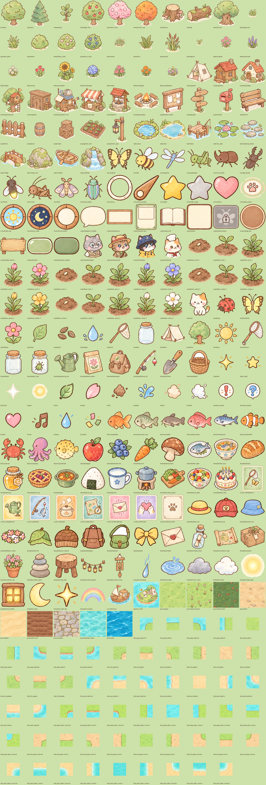
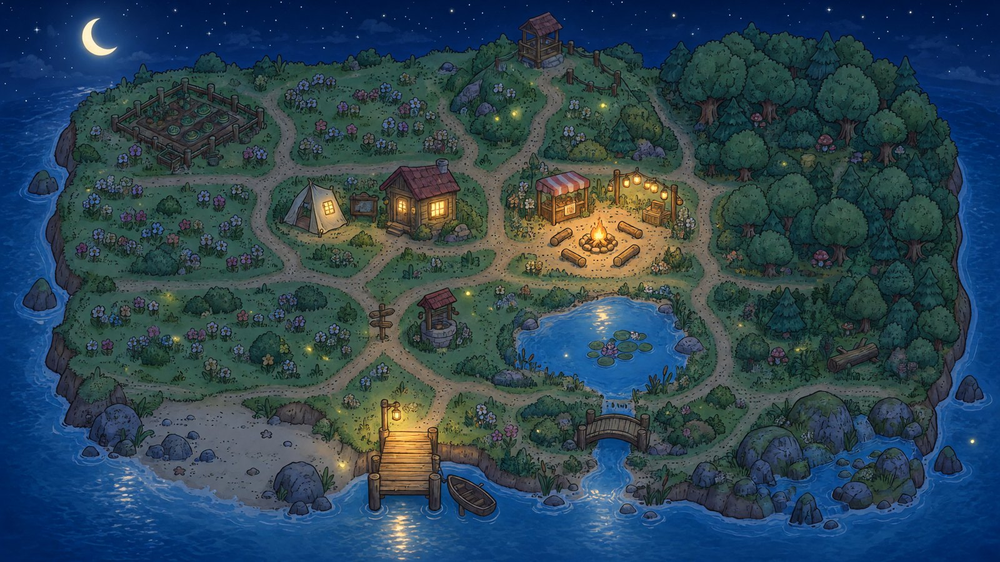
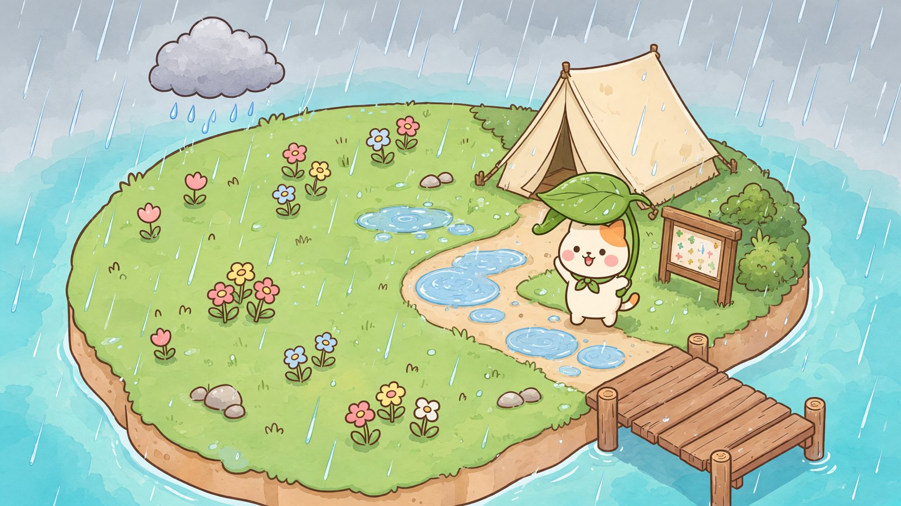
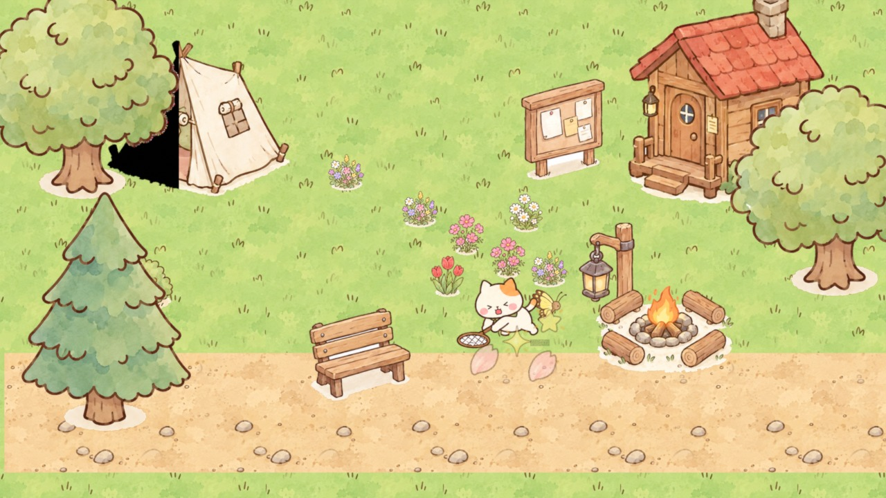

# 개발 일지

Island를 만드는 과정을 순서대로 기록한다. 의미 있는 결과가 나올 때마다 그림과 함께 남기고, 그 단계에서 나온 **요청(프롬프트)**과 **결정**을 같이 적는다. 사람과 LLM 모두 "왜 지금 이렇게 되어 있는지"를 여기서 찾을 수 있다.

---

## 2026-10-01 · 출발점: 고양이 시트와 도구

- 이미 있던 자산: 수채화풍 고양이 캐릭터 시트 2종(삼색, 샴), 섬 배경 한 장, 채집 장면 콘셉트.
- AI 시트를 게임용 아틀라스로 바꾸는 `sprite_slicer.py`, 7인 팔레트 스왑, 액션 랩(달리기·넘어짐 등을 파라미터로 만드는 도구)을 만들었다.
- 결정: 프레임을 새로 그리기보다 **도구로 정렬·재사용**한다. 액션은 `data/actions/*.json`으로 만든다.

---

## 2026-10-02 · 곤충 16종 → 10종 선택

> "채집할 곤충에 대한 에셋도 16종 1 시트에 만들어 봐 어떤 곤충을 하지 선택할게 번호도 붙혀"

1. 첫 시안은 고양이 얼굴(큰 눈·볼터치)을 그대로 따라 그려 곤충이 캐릭터처럼 보였다.
   > "곤충은 캐릭터시트 얼굴을 따라 갈 필요 없이 이미지 풍에 맞게 약간 귀엽게 평범하게"
2. 두 번째 시안은 도감처럼 너무 사실적이었다.
   > "나비처럼 단순하면서 큐티한 하게 만들어" — 콘셉트 이미지의 링 안 나비가 기준이 됐다.
3. 세 번째 시안으로 확정했다. 선택한 곤충은 1·3·4·5·7·8·9·13·14·15번이다: 호랑나비, 꿀벌, 잠자리, 메뚜기, 장수풍뎅이, 사슴벌레, 반딧불이, 귀뚜라미, 나방, 비단벌레.
4. 곤충마다 고양이와 같은 3행×4열 동작 시트를 만들었다(앞·뒤·옆 / 대기·이동·이동·도망). 장수풍뎅이는 뿔이 사슴벌레처럼 두 갈래로 나와서 외뿔로 다시 그렸다.

배운 점: 그림체 참고 이미지는 **"무엇을 따라 하지 말 것"**까지 같이 적어야 한다(캐릭터 얼굴 ≠ 곤충 얼굴).

---

## 2026-10-02 · 섬을 이루는 에셋 54개 + 바닥 타일

> "나무나 풀 꽃 숙소 게시판 호수등 섬을 구성하는 에셋도 9개 그리드로 구성 요소 모드를 만들어 봐"

- 나무·풀·꽃·건물·소품·물가를 9개씩 그려 54개를 만들었다. 섬 콘셉트를 참고 이미지로 넣어 시점과 톤을 맞췄다.
- 바닥은 반복 텍스처 9종과 경계 타일(잔디↔바다, 흙길↔잔디, 모래↔바다)로 만들었다.
- `env_slicer.py`로 시트를 잘라 투명 PNG로 만들고 월드 크기를 맞췄다. 잘린 모습은 `assets/env/_contact.png`에서 검수한다.

---

## 2026-10-02 · 섬의 크기: 3×3 → 4×4

> "섬을 사이즈를 캐릭터에 얼마나 차지 하는지 전체 구상도도 생성해"
> "아니 섬 규모를 알고 싶은거야 그건 내가 마음대로 조절 가능해?" → "4×4로 해줘"

- 기준: 타일 48px, 고양이 약 92px(타일 2칸), 화면 960×540 = 구역 1개.
- 섬 = 4×4 구역 = 3840×2160px. 고양이가 걸어서 가로지르는 데 약 27초 걸린다.
- 섬 넓이는 에셋과 상관없다. 구역 수를 바꿀 때는 맵 크기와 `data/world/zones.json`만 고치면 된다.

---

## 2026-10-02 · 빠진 에셋 조사와 보충

> "에셋 중에 빠진 것이 있는지 게임 개발에 요소를 검색 조사해서 알려 줘" → "빠진 에셋 만들어"

- 설계서의 기능과 일반적인 2D 모바일 게임 에셋 분류를 비교해 `ASSET_CHECKLIST.md`로 정리했다.
- 보충한 것: UI 전부, 박사님·수집가·낚시꾼 NPC 아틀라스, 초상화, 작물 4색×5단계, 단어 그림 12장, 도구·음식·꾸미기 아이템, 물고기 9종, 효과·날씨, 안쪽 모서리 타일, 앱 아이콘.
- 박사님이 말하는 동작이 손가락 하나를 세운 모양으로 나와서, 손바닥을 펴고 손을 흔드는 동작으로 다시 그렸다.
- 남은 것: 오디오(TTS·효과음·배경음). 이미지 생성 도구로는 만들 수 없다.

---

## 2026-10-02 · 쇼케이스 이미지 (Grok)

> "추가 에셋이 나오면 그건 grok을 higgsfield를 사용해서 이미지 추가 생성해 인벤토리나 이펙트 야경"

| | |
|---|---|
|  |  |
|  |  |

- 실제 에셋 시트를 참고 이미지로 넣어서 게임 화면이 "이렇게 보일 것"이라는 목표 그림을 만들었다.
- 인벤토리 목업은 도감 칸이 12개로 그려졌다(실제 목표는 10개). 이 그림들은 분위기를 보여 주는 목업이지 게임에 그대로 쓰는 에셋이 아니다.

---

## 2026-10-02 · 소개 사이트와 LLM용 데이터

> "게임 개발에 웹페이지를 구축 하면 다른 사람과 내용 공유 및 llm도 자료를 참조해서 db 처럼 사용 하는 한 것 같은데 지금 모인 에셋과 게임 월드를 소개하는 사이트를 만들어"

- 참고한 영상: AI가 게임을 만들면서 진행 과정을 웹 페이지로 기록했다. 중요한 기능이 들어갈 때마다 스크린샷을 남기고 사용자 피드백도 함께 적었다. 이 개발 일지가 그 방식을 따른 것이다.
- 사이트는 `tools/site_build.py`가 저장소 파일에서 매번 다시 만든다. GitHub Pages로 배포한다.
- LLM이 참조할 진입점은 `llms.txt`, `data/world.json`, `data/assets.json`이다.
- 역할 분담: 사이트 코드는 Codex(gpt-5.6-terra, high)가 쓰고 Claude가 검토한다. 추가 이미지는 Higgsfield Grok으로, 시연 영상은 Blender로 만든다.

---

## 2026-10-02 · Blender 프리비즈 → Higgsfield 시연 영상

> "blender로 프리비즈 만들어서 higgsfield로 영상 만들라는 거야"

1. **프리비즈 (Blender 4.2, `tools/blender_demo.py`)**: 실제 게임 에셋(타일·소품·고양이·나비 아틀라스·FX·UI)을 평면으로 깔고, 게임과 같은 탑다운 직교 카메라로 12초를 렌더링했다. 장면 순서는 걷기 → "!" → 포충망으로 잡기 → 단어 카드 → 밤 전환이다. 구도·동선·타이밍을 정하는 것이 목적이라 결함은 그대로 남아 있다(텐트 옆 검은 그림자, 덩어리진 불빛).
2. **최종 영상 (Higgsfield)**: 프리비즈를 동작 참고 영상으로, Grok 포획 장면과 고양이 시트를 그림체 참고로 넣어 다시 그렸다. Seedance 2.5(omni reference)는 사유 없이 실패해서 Kling 3.0 Omni Edit로 다시 생성하고 있다.

최종 영상은 생성이 끝나는 대로 이 자리에 추가한다.

배운 점: 생성형 영상은 **프리비즈가 구도와 타이밍을 고정**해 주면 장면이 흔들리지 않는다. 오류는 프리비즈 단계에서 고치지 말고 최종 생성 프롬프트에 적는다.

---

## 이 일지를 쓰는 규칙

- 단계가 끝날 때마다 위에 새 항목을 추가한다(날짜 · 제목).
- 사용자 요청은 인용(`>`)으로 원문 그대로 남긴다.
- 결과 그림은 `docs/img/`나 `assets/`에 있는 파일을 링크한다. 새 그림은 `docs/img/devlog/`에 둔다.
- 실패와 재시도도 적는다. 다음에 같은 실수를 반복하지 않기 위해서다.
