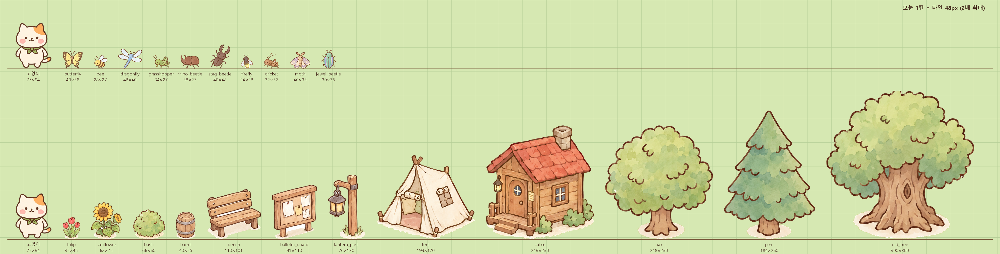

# 섬 구성과 크기 기준


## 1. 크기 기준 (월드 px)

| 항목 | 값 | 비고 |
|---|---|---|
| 화면(논리 캔버스) | 960×540 | `apps/client/src/main.ts` |
| 타일 | 48px | 화면 = 20×11.25 타일 |
| 고양이 키 | 약 92px | 타일 2칸, 화면 높이의 약 1/6 |
| 구역 | 화면 1장 (960×540) | 설계서 §3 "화면 단위로 나눔" |
| 섬 전체 | 4×4 구역 = 3840×2160 | 타일 80×45 |
| 이동 | 140px/s | 화면 1장 약 7초, 섬 가로 약 27초, 세로 약 15초 |

섬 넓이는 에셋과 무관하다. 구역 수를 바꾸려면 Tiled 맵 크기와 `data/world/zones.json`(구역 목록), `tools/island_overview.py`의 `GRID`만 고친다.

**파일은 월드 크기의 2배로 저장하고 게임에서 0.5배로 그린다.** 고양이 아틀라스(서 있는 키 183px)도 같은 규칙이라, 캐릭터·곤충·소품 모두 `setScale(0.5)` 하나로 크기가 맞는다. 고해상도 폰에서 선명하게 보이도록 2배로 저장한다.



## 2. 구역 배치 (4×4)

구역 데이터의 원본은 `data/world/zones.json`입니다. 이 문서는 그 내용을 그림으로 옮긴 것입니다.

| | 1 | 2 | 3 | 4 |
|---|---|---|---|---|
| **1** | 텃밭 | 꽃 들판 | 언덕·전망대 (후속) | 깊은 숲 (희귀 곤충) |
| **2** | 꽃 들판 | **캠프** (텐트·게시판·오두막) | 잔치 마당 (모닥불·가판대) | 숲 그늘 |
| **3** | 꽃 들판 | 갈림길 (이정표·우물) | 호수 | 숲 가장자리 |
| **4** | 바닷가 (후속) | 선착장 | 호숫가 (다리·개울) | 바위 해안 (후속) |

모든 구역은 흙길로 캠프와 이어진다. 시작 지점은 캠프다. 서쪽은 밝은 들판(쉬운 곤충·재배), 동쪽은 숲(희귀 곤충), 남쪽은 물가(낚시)로 나뉜다.

## 3. 오브젝트 크기 (월드 px)

`assets/env/manifest.json`에 파일마다 `world: [가로, 세로]`, `scale: 0.5`, `origin`(발밑, 깊이 정렬 기준)이 들어 있다.

| 분류 | 크기 |
|---|---|
| 곤충 | 24~48 (실제보다 크게 그림 — 아이가 탭할 수 있게. 고양이 머리 약 45px) |
| 꽃 | 40~75 |
| 풀·덤불 | 22~75 |
| 소품 | 술통 55 · 벤치 110(가로) · 게시판 110 · 가로등 130 |
| 건물 | 텐트 170 · 오두막 230 · 트리하우스 300 |
| 나무 | 묘목 70 · 나무 230 · 소나무 260 · 고목 300 |

크기를 바꾸려면 `tools/env_slicer.py`의 `PROPS` 표만 고치고 다시 실행한다.

## 4. 바닥 (타일)

- `assets/tiles/ground/*.png` — 384px(=타일 4×4) 반복 텍스처 9종: 잔디, 꽃잔디, 숲 바닥, 흙길, 모래, 밭, 돌길, 얕은 물, 바다. 상하좌우가 이어지도록 처리했다.
- `assets/tiles/tiles_*.png` — Tiled용 3×3 경계 타일(96px 타일 = 월드 48px). 순서는 `nw n ne / w c e / sw s se`.
  - `tiles_grass_water` 잔디↔바다 절벽, `tiles_dirt_grass` 흙길↔잔디, `tiles_sand_water` 모래↔바다.
  - 가장자리 타일을 여러 번 이어 붙이면 이음새가 보일 수 있다. 넓은 안쪽은 `c` 타일 대신 `ground/` 텍스처를 쓴다.

## 5. 다시 만들기

```
uv run tools/env_slicer.py        # content/ 시트 → assets/env, assets/insects/icons, assets/tiles
uv run tools/island_overview.py   # docs/img/island_overview.png, scale_chart.png
```
결과 검수: `assets/env/_contact.png` (잔디색 바탕이라 흰 테두리 남은 곳이 보인다).

## 6. 남은 일

- 섬 바닥을 Tiled로 실제 배치(위 4×4 구역 기준)하고 걷는 영역 마스크 그리기.
- 빠진 에셋 목록은 `docs/ASSET_CHECKLIST.md`.
- 소품 아래 옅은 베이지 그림자는 그대로 남겨 두었다(잔디 위에서 흙바닥처럼 보임). 거슬리면 슬라이서에서 지운다.
