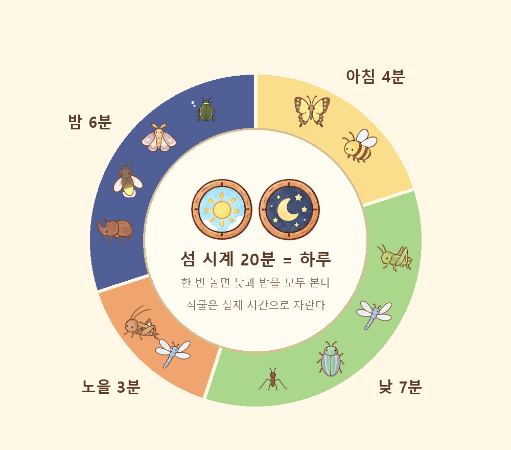
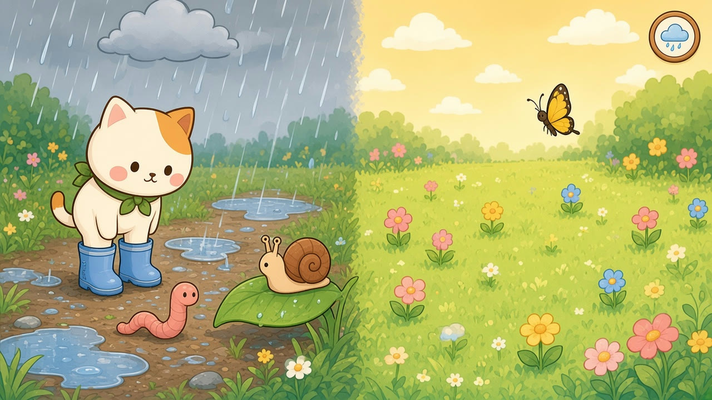
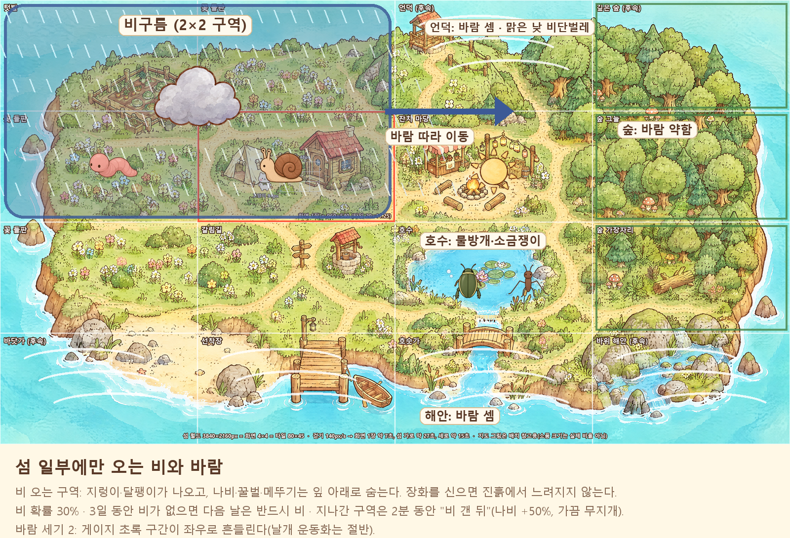

# Island — 날씨·시간·곤충 출현 기획

> 작성일: 2026-10-02 · 상태: 초안 v0.1 (수치는 플레이테스트로 조정)
> 관련: `REWARD_SYSTEM.md` §2(게이지 바 기본 수치), `DESIGN_AND_TECH_PLAN.md` §4·§7(시간·날씨 이벤트), 데이터 `data/world/species.json`, `zones.json`

---

## 1. 원칙

1. **날씨와 시간은 "어디서 무엇이 나오나"를 바꾼다.** 같은 들판도 비 오는 날, 밤에 오면 다른 생물이 있어서 다시 오고 싶게 만든다.
2. **어려워지는 건 조금만.** 게이지 판정이 약간 바뀔 뿐 벌점은 없다. 어려운 조건에서 잡으면 보상을 조금 더 준다.
3. **쉬운 생물도 같이 나온다.** 비가 오면 나는 곤충은 숨는 대신 느린 지렁이·달팽이가 나와서 초보도 잡을 수 있다.
4. **날씨는 영어로 알려 준다.** 게시판과 NPC가 `It's rainy at the lake!`처럼 말해서 유닛 5(Weather & Time)와 이어진다.

---

<a id="time"></a>

## 2. 섬 시계와 시간대



실제 시각을 그대로 쓰면 방과 후에만 들어오는 아이는 아침과 밤을 볼 수 없다. 그래서 **섬 시계는 20분에 하루가 한 바퀴** 돈다. 한 번 플레이(8~15분)하면 낮과 밤을 대개 한 번씩 본다.

| 시간대 | 길이 | 화면 | 나오는 곤충 |
|---|---|---|---|
| 아침 | 4분 | 밝은 톤, 이슬 반짝임 | 나비·꿀벌이 나오기 시작, 호수에 잠자리 |
| 낮 | 7분 | 기본 | 나비·꿀벌·메뚜기·잠자리, 맑은 날 언덕에 비단벌레(희귀) |
| 노을 | 3분 | 주황 톤 | 잠자리가 많아짐, 귀뚜라미 시작, 낮 곤충은 줄어듦 |
| 밤 | 6분 | 파란 톤, 등불·모닥불 빛 | 장수풍뎅이·사슴벌레(나무), 반딧불이(물가), 귀뚜라미·나방(숲·등불 주변), 물방개(호수) |

- 섬 시계는 서버가 정하고 같은 방의 모든 플레이어가 함께 쓴다.
- 식물 성장은 기존 설계대로 **실제 시간**을 쓴다(섬 시계와 따로).
- 밤에는 등불·모닥불·반딧불이 근처만 잘 보인다. 판정은 그대로이고, 곤충을 찾는 재미가 바뀐다.

---

<a id="rain"></a>

## 3. 날씨: 섬 일부에만 오는 비와 바람

### 3.1 국지 날씨



- **비는 섬 전체가 아니라 "비구름" 하나가 덮는 곳에만 온다.** 비구름은 구역 2×2 정도 크기이고, 바람 방향으로 천천히 옮겨 간다(구역 하나를 지나는 데 섬 시계로 약 3분).
- 비구름은 한 번에 최대 1개, 섬 시계 하루 중 비가 올 확률은 30%.
- 비가 지나간 구역은 2분 동안 **"비 갠 뒤"** 상태가 된다. 웅덩이가 남고 가끔 무지개가 뜬다.
- **바람**은 섬 전체에 방향 하나와 세기(0~2)가 있다. 지형에 따라 세기가 달라진다:
    - 언덕(`r0c2`)·바닷가·선착장·바위 해안(`r3c*`): 세기 +1
    - 깊은 숲·숲 그늘·숲 가장자리(`r0c3`, `r1c3`, `r2c3`): 세기 −1 (나무가 막아 준다)
- 알림: 게시판 아침 공지(`Today: sunny. Rain at the lake later.`), 미니맵의 구역별 날씨 아이콘, 비 오는 구역에 들어가면 화면 가장자리에 빗방울 효과.



### 3.2 날씨별 출현 변화

| 날씨 | 줄어드는 것 | 늘어나는 것 · 새로 나오는 것 |
|---|---|---|
| 맑음 | — | 기본. 비단벌레는 맑은 낮에만 |
| 흐림 | 나비 −20% | 잠자리 +20% |
| 비 | 나비·꿀벌·메뚜기 −70% (잎 아래에서 비를 피함, 탭하면 "쉿, 비 피하는 중" 연출만), 잠자리 −50%, 반딧불이 안 나옴 | **지렁이·달팽이** 등장(흙길·풀밭·텃밭), 비 오는 밤 등불 근처 물방개 +50% |
| 비 갠 뒤 | — | 나비 +50%, 달팽이 계속, 무지개가 뜨면 희귀 나비(저널 마지막 칸) 낮은 확률 |
| 바람 (세기 2) | 꿀벌 −30% | 잠자리 +30% (바람 타고 날아다님) |

---

## 4. 판정 난이도 보정

기본값은 `REWARD_SYSTEM.md` §2의 희귀도별 표를 따른다. 아래 보정을 더하고, 초록 구간은 최소 10%를 지킨다.

| 조건 | 초록 구간 | 마커 속도 | 그 밖 |
|---|---|---|---|
| 비 오는 구역의 나는 곤충 | −4%p | 그대로 | 남아 있는 녀석은 예민하다 |
| 지렁이·달팽이 (비 생물) | **+10%p** | **−30%** | 초보도 잡을 수 있는 쉬운 생물 |
| 비 오는 구역의 이동 | — | — | 진흙에서 고양이 이동 −20%. **장화(신발 2단계)** 신으면 없음 |
| 바람 세기 1 | 구간이 좌우로 천천히 흔들림(±8%) | 그대로 | 나는 곤충만 |
| 바람 세기 2 | 흔들림 ±15% | +15% | **날개 운동화(신발 3단계)**는 흔들림 절반 |
| 밤 | 그대로 | 그대로 | 빛 근처에서만 곤충이 잘 보임 |

**어려운 조건 보상**: 비 오는 구역에서 나는 곤충을 잡거나 바람 세기 2에서 잡으면 조개 +1.

---

## 5. 출현(스폰) 규칙 — M1에서 정할 것

- **출현 지점**은 Tiled 맵의 오브젝트 레이어에 점으로 둔다. 종류: `flower`(꽃), `tree`(나무 줄기), `ground`(풀·흙), `water`(물가), `light`(등불).
- 구역마다 **동시에 최대 3마리**. 희귀도 3은 섬 전체에 1마리만.
- 자리가 비면 실제 시간 **15~30초 뒤** 다시 나온다.
- 어떤 종이 나올지는 그 구역 후보(`species.json`의 `zones`) 중에서 **시간대 × 날씨 × 희귀도** 가중치로 고른다. 희귀도 가중치는 1:60, 2:30, 3:10.
- 도망간 곤충은 20초 뒤 같은 구역의 다른 지점에 다시 나온다.
- 비단벌레(희귀도 3)는 맑은 낮 언덕에서, 플레이어마다 섬 시계 하루에 한 번까지.
- **파티**: 곤충은 방 공용이다. 같은 곤충을 여럿이 함께 시도할 수 있고, 누가 성공하든 **옆에 있던 파티원 모두 도감에 등록**한다(경쟁 없음 원칙).
- 출현은 서버가 정하고 클라이언트는 보여 주기만 한다.

데이터 예시 (`species.json`에 필드 추가):

```jsonc
{ "id": "butterfly", "spawn": ["flower"], "phases": ["morning", "day"],
  "weather": { "cloudy": 0.8, "rain": 0.3, "after_rain": 1.5 } }
{ "id": "worm", "spawn": ["ground"], "phases": ["morning", "day", "dusk", "night"],
  "weather": { "rain": 1.0, "after_rain": 0.6, "default": 0 }, "ease": { "zone_pct": 10, "marker": -0.3 } }
```

---

## 6. 새 생물 후보 (에셋 필요)

| 생물 | 영어 | 나오는 조건 | 구역 | 희귀도 | 메모 |
|---|---|---|---|---|---|
| 지렁이 | worm | 비, 비 갠 뒤 | 텃밭 `r0c0`, 갈림길 흙길 `r2c1`, 꽃 들판 | 1 | 비 오면 땅 위로 나오는 대표 생물. 징그럽지 않게 동글동글하게 그린다 |
| 달팽이 | snail | 비, 비 갠 뒤 | 꽃 들판, 숲 가장자리 `r2c3` | 1 | 잎·꽃 위에 붙어 있음. 가장 쉬운 생물 |
| 물방개 | water beetle | 언제나 (밤 비에 등불 근처 +50%) | 호수 `r2c2`, 호숫가 `r3c2` | 2 | **비 전용이 아니다.** 연못·호수에 1년 내내 사는 물속 곤충이다. 밤에 불빛으로 날아오는 습성이 있어서 "비 오는 밤 등불" 보너스만 준다 |
| 소금쟁이 | water strider | 맑은 낮 | 호수, 호숫가 | 1 | 선택. 물 위를 미끄러지듯 움직임 |

- 생물마다 필요한 에셋: 3×4 동작 시트(앞·뒤·옆 / 대기·이동·이동·도망), 도감 아이콘, 단어 카드 그림.
- **동작 시트 4종 완료**(2026-10-02, Grok): `assets/insects/insect_{worm,snail,waterbeetle,waterstrider}`. 달팽이는 이동 프레임이 모두 같아서 게임에서 늘였다 줄이는 효과로 움직임을 준다. 도감 아이콘(`assets/insects/icons/`), 단어 그림(`assets/words/`), `species.json`·`zones.json` 등록도 끝났다.
- 설계서에 있던 개구리는 곤충이 아니어서 채집 대상이 아니라 비 오는 날 **관찰만 하는 배경 생물**로 둔다.

---

## 7. 학습 연결

- 유닛 5(Weather & Time) 어휘: `sunny`, `cloudy`, `rainy`, `windy`, `rainbow`, `wet`, `morning`, `night` + 생물 `worm`, `snail`.
- 비 오는 구역에 들어가면 NPC가 `It's raining! Look, a snail!`처럼 말한다.
- 날씨 퀘스트 예: `Find a snail on a rainy day.`, `Catch a dragonfly on a windy day.`
- 도감 카드에 "만난 날씨" 스탬프(맑음·비·바람·밤)를 찍어서 같은 곤충을 다른 날씨에 다시 잡을 이유를 만든다.

---

## 8. 정한 것 (2026-10-02)

1. **섬 시계는 20분에 하루.** 방과 후에만 들어오는 아이도 아침과 밤을 모두 본다. 식물 성장만 실제 시간을 쓴다.
2. **새 생물 4종을 모두 넣는다.** 지렁이·달팽이·물방개·소금쟁이를 `species.json`과 각 구역 목록에 등록했다(동작 시트·도감 아이콘·단어 그림 완료).
3. **비 확률 30%, 비구름 2×2 구역은 그대로 간다.** 대신 섬 시계로 3일 동안 비가 한 번도 오지 않으면 다음 날은 반드시 비가 온다. 비 생물을 못 만나는 날이 길어지지 않게 하기 위해서다.
4. **파티원 모두 도감 등록.** 단, 같은 화면(같은 구역)에 있는 파티원만이다. 다른 구역에 있으면 등록되지 않는다.
